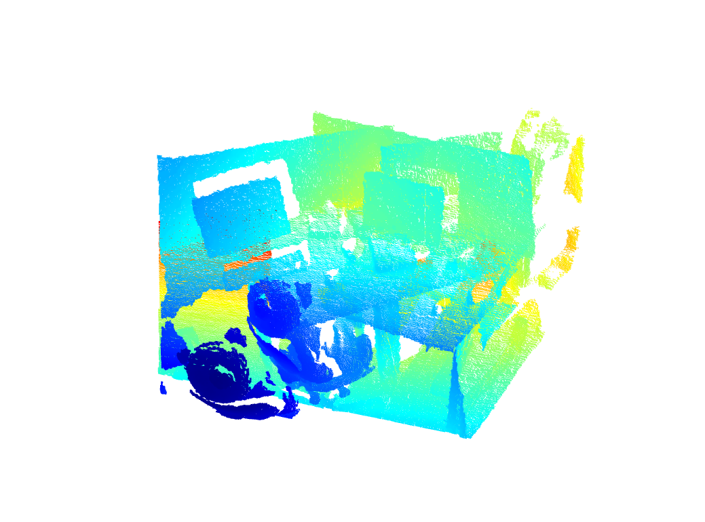
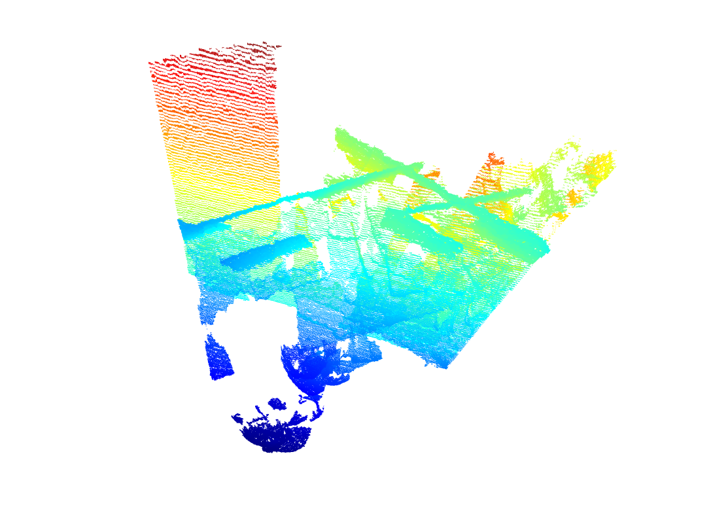
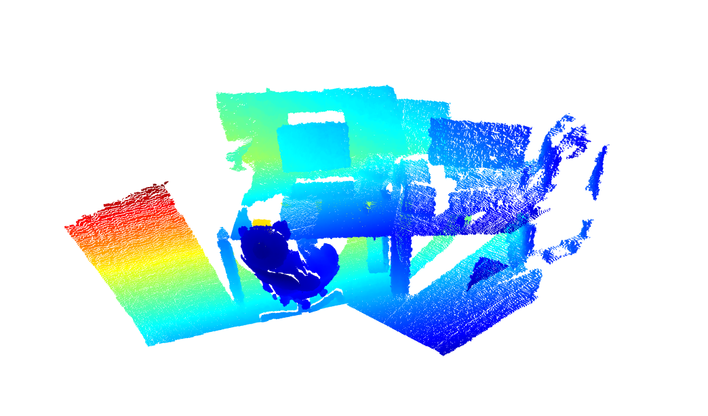
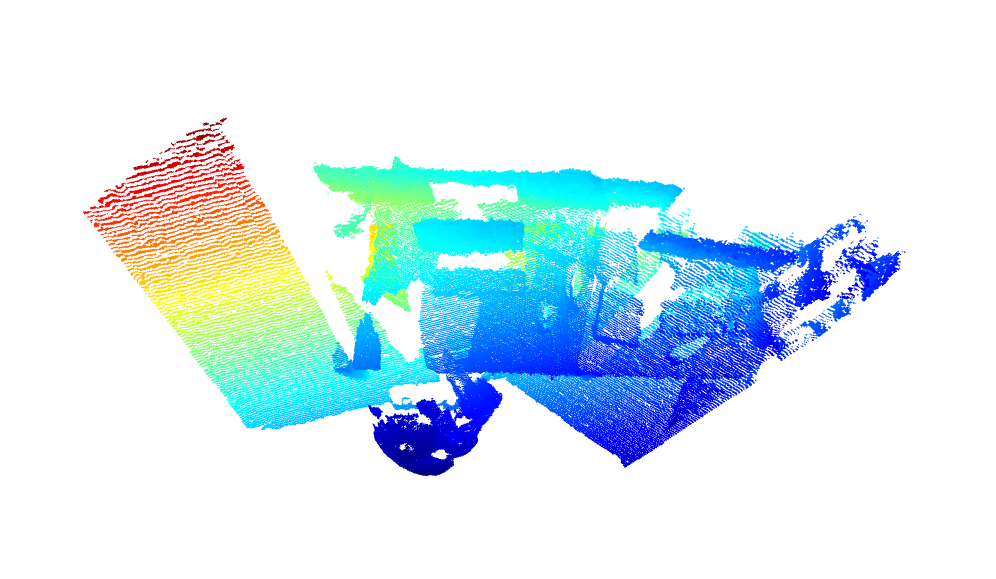
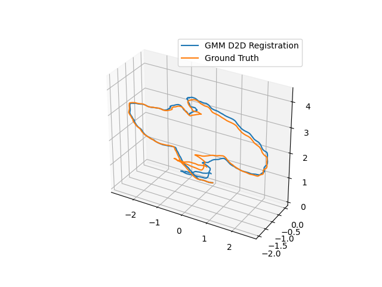
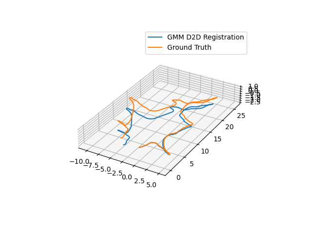
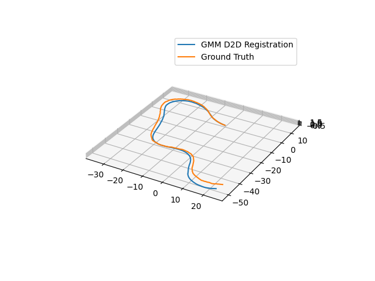

# Python

## Overview
The following packages are used for this Python tutorial:
[gmm](TODO), [gmm_d2d_registration_py](TODO), and
[gmm_d2d_registration_examples](TODO).

The `gmm_d2d_registration_examples` package contains Python scripts
for

* registering a single pair of GMMs,
* closing the loop using a pose graph,
* processing entire datasets, and
* creating GMMs using SKLearn and saving to file (used for registration)


## Initialize the Python Environment
To initialize the python paths properly, you should `source workon`
at the top level sandbox directory.

```bash
cd gira3d-registration
source workon
```

## Download Data
The `data` directory contains a script that you will need to execute
in order to download all of the data associated with this tutorial.

```bash
pip install gdown
cd gira3d-registration/data
./download.sh
```

The complete dataset is quite large so be prepared for this to take
some time.

## Registering a Pair of GMMs
Go to the `gmm_d2d_registration_examples/python` directory
under `wet/src` and run the `registration_example.py` file.

```python
cd wet/src/gmm_d2d_registration_examples/python
python registration_example.py
```

Two figures will display. The first figure displays before
registration. The second figure displays the registration result.
Note: the registration result displays pointclouds (not GMMs or
resampled GMMs). These figures show two views of the pointclouds
before registration.

{width=50%}{width=50%}

And here are the results after registration. Note the lines are
aligned in the below right image.

{width=50%}{width=50%}

### Explanation of the Script
An isoplanar registration is run first:
```python
Tinit = np.eye(4)
Tinit = gmm_d2d_registration_py.isoplanar_registration(Tinit, source_file, target_file)
```
`Tinit` is a 4x4 transformation matrix consisting of a 3x3 rotation and 3x1 translation.
Anisotropic registration may be run using the following function call:
```python
Tout = gmm_d2d_registration_py.anisotropic_registration(Tinit, source_file, target_file)
```
The 3x3 rotation matrix and translation vector are extracted using:
```python
Rotation = Tout[0:3,0:3]
translation = Tout[0:3,3]
```
The aligned pointclouds are displayed using Open3D.

## TUM Registration
To run the full TUM registration pipeline with pre-made GMMs, you can
use the script in `gmm_d2d_registration_examples/python/run_tum_dataset.py`.
```python
python run_tum_dataset.py
```
The result will be the trajectory generated from frame-to-frame
registration with the ground truth plotted on top. The axes are
in meters.



## Cave Registration
To run the cave dataset with pre-made GMMs, you can use the script in
`gmm_d2d_registration_examples/python/run_cave_dataset.py`
```python
python run_cave_dataset.py
```



## Mine Registration
To run the cave dataset with pre-made GMMs, you can use the script in
`gmm_d2d_registration_examples/python/run_mine_dataset.py`.
```python
python run_mine_dataset.py
```



## Closing the loop and using Pose Graphs
Software is provided with an example of how to close the loop.
```
python pose_graph_example.py
```
The result will be a video that looks like the following:

<video playsinline autoplay muted loop>
  <source src="../movies/pose_graph_python.mp4" type="video/mp4">
</video>

where ground truth is in blue and the pose graph trajectory
is shown in orange.

## Creating GMMs using Sklearn
A script is provided to learn GMMs using sklearn.
In order to do so, you will need to install `scikit-learn`.
```python
pip install scikit-learn
```
The script is provided in the
`gmm_d2d_registration_example/python/utils/create_and_save_gmm_example.py` script.

```python
python create_and_save_gmm_example.py
```

The GMM will be saved in your current working directory.  The GMMs are
saved in the format used to run registration.

## Operating Systems
These tutorials have been tested on the following operating systems:

* Ubuntu 18.04
* Ubuntu 20.04
